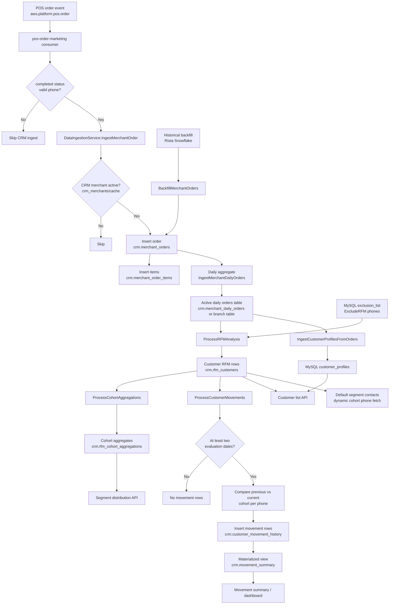
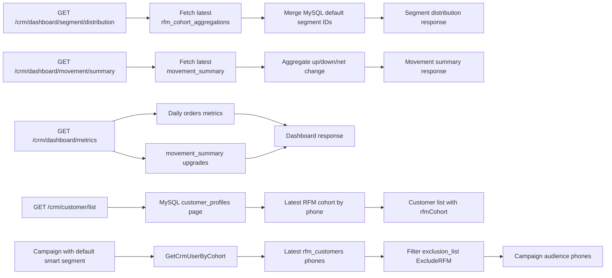

# Marketing RFM Flow Analysis

Generated from code inspection and read-only DB schema checks on 2026-06-15.

## Executive Summary

Marketing RFM is a ClickHouse-first CRM analysis flow. Raw POS orders enter `crm.merchant_orders`, are aggregated into daily customer/order rows, then RFM scoring writes customer-level cohort rows to `crm.rfm_customers`. A second aggregation writes cohort-level dashboard rows to `crm.rfm_cohort_aggregations`. After every RFM run, the service also upserts customer profile rows into MySQL `marketingDB.customer_profiles` and detects cohort movement between the latest two RFM evaluation dates, writing movement records to `crm.customer_movement_history`.

The main orchestrator is `DataIngestionService.ProcessCRMAnalysis`, which runs these four steps in order:

1. `ProcessRFMAnalysis`
2. `ProcessCohortAggregations`
3. `IngestCustomerProfilesFromOrders`
4. `ProcessCustomerMovements`

## Entry Points

### Onboarding / Full ETL

Admin CRM onboarding creates/updates the CRM merchant record, invalidates CRM active-merchant cache, and starts a background full ETL job.

Flow:

1. `POST /admin/crm/onboard`
2. `CRMUseCase.processUserOnboarding`
3. `CRMUseCase.runFullRFMAnalysisAndCreateSegments`
4. background goroutine:
   - `DataIngestionService.FullETLPipeline`
   - `BackfillMerchantOrders`
   - `IngestMerchantDailyOrders`
   - `ProcessCRMAnalysis`
   - `segmentUC.CreateDefaultSegmentsBySource`

Full ETL uses `utils.CrmBackfillDays = 365` for order backfill and `utils.RFMAnalysisDays = 90` for RFM.

### On-Demand Smart Segment Refresh

RFM can rerun when rule/default smart segments are refreshed or used for campaign contact saving.

Flow:

1. Segment refresh/save detects overlap with default smart segments from MySQL `segment`.
2. If the relevant smart segment data is stale or required, `segmentUC.runOnDemandRFM` runs under lock `ondemand:lock:rfm_analysis_<merchantID>`.
3. It validates the merchant is active in `crm_merchants`.
4. It calls `DataIngestionService.ProcessCRMAnalysis(merchantID, 90)`.

### Daily Cron

The current daily cron only updates daily order aggregates for a rolling two-day window. In the inspected code, it does not call `ProcessCRMAnalysis` for all merchants.

Flow:

1. Cron runs daily at `01:00:00` IST under lock `cron:lock:crm_etl`.
2. `CRMCronService.runDailyETL`
3. `DataIngestionService.MigrateAllDailyOrders(startDate = now - 2 days, endDate = now)`
4. `CRMRepository.IngestAllDailyOrdersFromMerchantOrders`
5. Optimizes the active daily-orders table and invalidates customer metrics caches.

## Source Data

### Real-Time POS Orders

Kafka consumer: `scripts/consumers/pos-order-marketing/main.go`

1. Consumes `aws.platform.pos.order`.
2. Skips non-completed orders.
3. Validates phone.
4. Fire-and-forget CRM ingest calls `DataIngestionService.IngestMerchantOrder`.
5. `IngestMerchantOrder` checks `crm_merchants` active status using cache key from `helper.GetCRMActiveMerchantCacheKey`.
6. Inserts valid order into ClickHouse `crm.merchant_orders`.
7. Inserts order items into `crm.merchant_order_items` when present.

`crm.merchant_orders` fields verified in prod:

- `order_id`, `merchant_id`, `brand_id`, `branch_id`, `business_id`
- `phone`, `name`, `email`, `amount`, `order_time`
- `service_type`, `service_subtype`, `status`, `order_source`, `source`, `payment_modes`
- `created_at`, `updated_at`

### Historical Backfill

Backfill source: Rista Snowflake via `providers.RistaSnowflakeProvider`.

Flow:

1. Fetch active CRM merchant from MySQL `crm_merchants`.
2. Fetch branch IDs from external Rista.
3. Fetch business ID from external Rista.
4. Read historical orders from Snowflake `SALE` and items from `SALE_ITEMS`.
5. Insert order rows into `crm.merchant_orders`.
6. Insert item rows into `crm.merchant_order_items`.
7. Optional `OPTIMIZE TABLE ... FINAL` for dedupe.

## Daily Order Aggregate

RFM does not score directly from raw `crm.merchant_orders`. It reads the active daily aggregate table.

Code constant:

- `utils.CRMMerchantOrdersTable = "crm.merchant_orders"`
- `utils.CRMDailyOrdersLiveTable = "crm.merchant_daily_orders_branch"` in current code

Prod schema currently has `crm.merchant_daily_orders`; the repo also has `merchant_daily_orders_branch.sql`. Treat the exact live table name as environment/deployment dependent.

Aggregation query shape:

```sql
INSERT INTO <CRMDailyOrdersLiveTable>
SELECT
  merchant_id,
  branch_id,
  phone,
  toDate(order_time, 'Asia/Kolkata') AS order_date,
  argMax(name, order_time) AS customer_name,
  argMax(email, order_time) AS customer_email,
  count() AS order_count,
  sum(amount) AS order_value,
  toUInt8(intDiv(toHour(max(order_time), 'Asia/Kolkata'), 2)) AS business_hour
FROM crm.merchant_orders FINAL
WHERE lower(status) IN ('completed', 'closed')
  AND phone != ''
GROUP BY merchant_id, branch_id, phone, order_date
```

Branch-aware table from repo migration:

- Engine: `ReplacingMergeTree(updated_at)`
- Partition: `(merchant_id, toYYYYMM(order_date))`
- Order key: `(merchant_id, branch_id, phone, order_date)`
- TTL: `order_date + 365 days`
- Main data: merchant, branch, phone, daily order count/value, customer name/email, peak-hour bucket.

## RFM Customer Scoring

Method: `CRMRepository.ProcessRFMAnalysis`

### Inputs

1. Active daily orders table.
2. `merchant_id`.
3. `timeWindowDays`, normally `90`.
4. Exclusion phones from MySQL `exclusion_list` where `exclusion_flags` has `entity.ExcludeRFM`.

### Filters

RFM excludes:

- Merchant mismatch.
- Orders older than `subtractDays(today(), timeWindowDays)`.
- Obvious test phones matching `^(6{10}|7{10}|8{10}|9{10})$`.
- Phones from `exclusion_list` with RFM exclusion flag.

### RFM Base Metrics

Grouped by `merchant_id, phone`:

- `recency_days = dateDiff('day', max(order_date), today())`
- `frequency_orders = sum(order_count)`
- `monetary_amount = sum(order_value)`

### Score Calculation

The query ranks all customers within the merchant/window:

- `r_rank = row_number() over (order by -recency_days)`
- `f_rank = row_number() over (order by frequency_orders)`
- `m_rank = row_number() over (order by monetary_amount)`
- Each rank is divided by `total_count` and bucketed into scores `1..5`:
  - `> 0.80 => 5`
  - `> 0.60 => 4`
  - `> 0.40 => 3`
  - `> 0.20 => 2`
  - else `1`

Note: because recency uses `ORDER BY -recency_days`, lower recency days rank later and receive higher `r_score`.

### Cohort Mapping

The customer is assigned to one of these cohorts:

| Cohort | Rule |
| --- | --- |
| Champions | `r=5 AND f=5 AND m=5` |
| Loyal Customers | `r=3..5 AND f=4..5` |
| Cannot Lose Them | `r=1..2 AND f=3..5 AND m=4..5` |
| Potential Loyalists | `r=3..5 AND f=2..3` |
| At Risk | `r=1..2 AND f=3..5 AND m=2..3` |
| Promising Customers | `r=4..5 AND f=1 AND m=2..5` |
| New Customers | `r=4..5 AND f=1 AND m=1` |
| Need Attention | `r=3 AND f=1..2` |
| About to Sleep | `r=2 AND f=1..2` |
| Hibernating | `r=1 OR (r=2 AND m=1)` |
| Unclassified | fallback |

### Output Table: `crm.rfm_customers`

Verified prod schema:

- Engine: `ReplacingMergeTree(updated_at)`
- Order key: `(merchant_id, phone, evaluation_date)`
- TTL: `evaluation_date + 90 days`
- Columns:
  - `merchant_id UInt32`
  - `phone String`
  - `recency_days UInt16`
  - `frequency_orders UInt64`
  - `monetary_amount Decimal(18,2)`
  - `r_score UInt8`
  - `f_score UInt8`
  - `m_score UInt8`
  - `cohort LowCardinality(String)`
  - `evaluation_date Date`
  - `time_window_days UInt16`
  - `created_at DateTime`
  - `updated_at DateTime`

Prod active parts snapshot on 2026-06-15: ~12.05M rows, ~123.68 MiB.

## Cohort Aggregation

Method: `CRMRepository.ProcessCohortAggregations`

Input: today's `crm.rfm_customers` rows for the merchant and same `time_window_days`.

Grouped by `cohort`, it calculates:

- `customer_count = count(*)`
- `total_revenue = sum(monetary_amount)`
- `average_revenue = avg(monetary_amount)`
- `average_recency = avg(recency_days)`
- `average_frequency = avg(frequency_orders)`
- `total_visits = sum(frequency_orders)`
- `distribution = customer_count * 100 / total_count`
- `average_order_value = total_revenue / total_visits`
- `visit_frequency = total_visits / customer_count`

Output table: `crm.rfm_cohort_aggregations`

Verified prod schema:

- Engine: `ReplacingMergeTree(updated_at)`
- Order key: `(merchant_id, evaluation_date, cohort)`
- Columns:
  - `merchant_id UInt32`
  - `evaluation_date Date`
  - `time_window_days UInt16`
  - `cohort LowCardinality(String)`
  - `customer_count UInt64`
  - `total_revenue Decimal(18,2)`
  - `average_revenue Decimal(18,2)`
  - `average_recency Decimal(18,2)`
  - `average_frequency Decimal(18,2)`
  - `distribution Decimal(18,2)`
  - `average_order_value Decimal(18,2)`
  - `visit_frequency Decimal(18,2)`
  - `created_at DateTime`
  - `updated_at DateTime`

Prod snapshot on 2026-06-15: 3,959 rows.

## Customer Profile Sync

Method: `DataIngestionService.IngestCustomerProfilesFromOrders`

Input query groups daily orders by `merchant_id, phone` over the RFM window and selects:

- `merchant_id`
- `phone`
- `anyLast(customer_name)`
- `anyLast(customer_email)`

Output: MySQL `marketingDB.customer_profiles`, via `CRMMySQLRepository.UpsertCustomerProfile`.

Verified MySQL columns:

- `id char(36)`
- `merchant_id int`
- `phone varchar(15)`
- `customer_name varchar(255)`
- `customer_email varchar(255)`
- `last_campaign_id varchar(35)`
- `created_at timestamp`
- `updated_at timestamp`

This table powers CRM customer list pagination and profile lookup by internal customer ID.

## Movement Analysis

Method: `DataIngestionService.ProcessCustomerMovements`

### Trigger

Movement detection runs after each successful `ProcessCRMAnalysis`.

### Input

1. `CRMRepository.GetLastTwoEvaluationDates` reads latest two distinct `evaluation_date` values from `crm.rfm_customers` for the merchant.
2. If fewer than two dates exist, movement detection exits.
3. `GetRFMCustomersForDate` loads all customer RFM rows for previous and current dates.

### Detection Rule

For each phone in current RFM:

- Ignore if phone was not present in previous RFM.
- Ignore if cohort did not change.
- Otherwise create a movement record.

### Movement Type

Cohorts are ranked:

1. Hibernating
2. About to Sleep
3. At Risk
4. Cannot Lose Them
5. Need Attention
6. New Customers
7. Promising Customers
8. Potential Loyalists
9. Loyal Customers
10. Champions

If current rank is higher: `Up`.

If current rank is lower: `Down`.

Equal rank would be `Stable`, but unchanged cohorts are skipped before classification.

### Impact Level

Absolute rank jump:

- `1 => Low`
- `2 => Medium`
- anything else => `High`

### Revenue Impact

`revenue_impact = current_monetary_amount - previous_monetary_amount`

### Output Table: `crm.customer_movement_history`

Verified prod schema:

- Engine: `ReplacingMergeTree(updated_at)`
- Partition: `(merchant_id, toYYYYMM(current_evaluation_date))`
- Order key: `(merchant_id, phone, current_evaluation_date)`
- TTL: `current_evaluation_date + 90 days`
- Columns:
  - `merchant_id UInt32`
  - `phone String`
  - `previous_cohort LowCardinality(String)`
  - `current_cohort LowCardinality(String)`
  - `movement_type LowCardinality(String)`
  - `impact_level LowCardinality(String)`
  - `previous_evaluation_date Date`
  - `current_evaluation_date Date`
  - `previous_monetary_amount Decimal(18,2)`
  - `current_monetary_amount Decimal(18,2)`
  - `revenue_impact Decimal(18,2)`
  - `movement_detected_at DateTime`
  - `created_at DateTime`
  - `updated_at DateTime`

Prod snapshot on 2026-06-15: ~4.75M rows, ~101.15 MiB.

### Summary View: `crm.movement_summary`

Verified prod materialized view:

```sql
SELECT
  merchant_id,
  previous_cohort,
  current_cohort,
  movement_type,
  impact_level,
  current_evaluation_date,
  count() AS movement_count
FROM crm.customer_movement_history
GROUP BY
  merchant_id,
  previous_cohort,
  current_cohort,
  movement_type,
  impact_level,
  current_evaluation_date
```

Engine: `SummingMergeTree`

Dashboard summary reads this view.

## Default Smart Segment Linkage

Default RFM smart segments are MySQL metadata records in `marketingDB.segment`.

Creation flow:

1. After onboarding full ETL succeeds, `segmentUC.CreateDefaultSegmentsBySource` creates one default segment for each RFM cohort.
2. For both `rista` and `dotpe`, current code uses the Rista cohort names/descriptions and stores `source = 'rista'`.
3. Segment count is fetched from `crm.rfm_cohort_aggregations` through `GetCrmUserCountByCohort`.
4. It inserts `segment` records with:
   - `merchant_id`
   - `segment_name`
   - `description`
   - `source`
   - `segment_type = rule_based`
   - `is_default = true`
   - `contacts`

`segment_customers` is not populated for these default RFM smart segments during creation. When contacts are needed, default segment users are fetched dynamically from `crm.rfm_customers` through `GetCrmUserByCohort`.

Verified MySQL segment fields used in this area:

- `segment.id`
- `segment.merchant_id`
- `segment.segment_name`
- `segment.description`
- `segment.segment_type`
- `segment.contacts`
- `segment.unsubscribed_contacts`
- `segment.filters`
- `segment.contact_last_updated_at`
- `segment.status`
- `segment.is_deleted`
- `segment.is_default`
- `segment.source`
- `segment.created_at`
- `segment.updated_at`

## Read-Side Flows

### Segment Distribution API

Endpoint: `GET /crm/dashboard/segment/distribution`

Flow:

1. Handler sets `merchantId` from auth.
2. Usecase calls `crmRepo.FetchRFMCohortAggregations`.
3. Repository reads max `evaluation_date` from `crm.rfm_cohort_aggregations`.
4. Repository returns data for the ten known cohorts in fixed order, filling missing cohorts with zero values.
5. Usecase fetches MySQL default Rista segments via `crmMySQLRepo.GetDefaultRistaSegments`.
6. Response merges RFM metrics with `segmentId`, `createdAt`, and `updatedAt`.

Returned per segment:

- `name`
- `segmentId`
- `count`
- `distribution`
- `averageOrderValue`
- `visitFrequency`
- `createdAt`
- `updatedAt`

### Movement Summary API

Endpoint: `GET /crm/dashboard/movement/summary`

Flow:

1. Usecase calls `crmRepo.GetCustomerMovementSummary`.
2. Repository reads latest `current_evaluation_date` from `crm.movement_summary`.
3. Returns movement rows ordered by `movement_count DESC`.
4. Usecase returns row details plus aggregates:
   - total upgrades
   - total downgrades
   - net change

### Dashboard Metrics API

Endpoint: `GET /crm/dashboard/metrics`

Flow:

1. Runs several ClickHouse reads in parallel.
2. Most metrics read active daily orders table.
3. `segmentUpgrades` reads `crm.movement_summary`.

Metrics:

- Active customers
- Average order value
- New customers
- Returning customers
- Revenue concentration
- Peak hour
- Segment upgrades

### Customer List API

Endpoint: `GET /crm/customer/list`

Flow:

1. Reads paginated customers from MySQL `customer_profiles`.
2. On first page also reads total count from `customer_profiles`.
3. Collects page phones.
4. Calls `crmRepo.GetLatestRFMCohortsByPhones`.
5. ClickHouse reads latest `evaluation_date` from `crm.rfm_customers`.
6. Enriches each customer row with `rfmCohort`.

### Campaign / Segment Contact Fetch

Default RFM segment contacts are dynamic:

1. Segment usecase sees `IsDefault = true`.
2. Rista user fetcher calls `crmRepo.GetCrmUserByCohort`.
3. ClickHouse reads latest `crm.rfm_customers` for the merchant/cohort.
4. MySQL `exclusion_list` is checked again for `ExcludeRFM`.
5. Returns phone list to campaign/segment code.

## End-to-End Flowchart



## Read-Side Flowchart



## Data Storage Map

| Stage | Source | Destination | Purpose |
| --- | --- | --- | --- |
| POS event ingest | Kafka `aws.platform.pos.order` | ClickHouse `crm.merchant_orders` | Raw order fact for CRM |
| Order item ingest | Kafka order items / Snowflake SALE_ITEMS | ClickHouse `crm.merchant_order_items` | Item-level order detail |
| Daily aggregation | `crm.merchant_orders FINAL` | active daily orders table | Daily per merchant/branch/phone/order_date aggregate |
| RFM scoring | active daily orders + MySQL exclusions | `crm.rfm_customers` | Customer-level RFM metrics, scores, cohort |
| Cohort aggregation | `crm.rfm_customers` | `crm.rfm_cohort_aggregations` | Dashboard segment distribution and default segment counts |
| Profile sync | active daily orders | MySQL `customer_profiles` | Paginated customer list and profile lookup |
| Movement detection | latest two dates in `crm.rfm_customers` | `crm.customer_movement_history` | Cohort transition history |
| Movement summary | `crm.customer_movement_history` | `crm.movement_summary` materialized view | Dashboard movement summary |
| Default segment metadata | RFM cohort list + cohort counts | MySQL `segment` | Smart segment records and IDs |

## Important Observations

1. RFM scoring is merchant-wide in current implementation. Branch-aware daily orders are preserved in the aggregate table, but `ProcessRFMAnalysis` groups only by `merchant_id, phone`, not by branch.
2. Current code constant points to `crm.merchant_daily_orders_branch`; prod schema currently has `crm.merchant_daily_orders`. Verify deployment config/table rename before running RFM in a given environment.
3. The daily cron updates the daily-order aggregate only. It does not rerun RFM for all merchants in the inspected code.
4. Movement detection only compares customers present in both latest evaluation dates. New customers and lost customers are not recorded as movement records.
5. Movement type values in prod are `Up` and `Down`.
6. Default RFM smart segments are metadata/count records in MySQL `segment`; customer membership is fetched dynamically from latest `rfm_customers`.
7. Exclusion handling exists at scoring time and again when fetching default segment contacts.
8. `rfm_customers` and `customer_movement_history` both have 90-day TTLs in prod; the daily-order table has a 365-day TTL.
